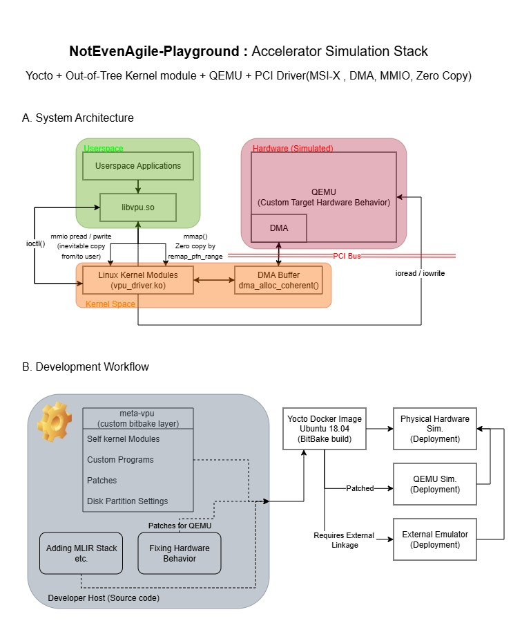

# VPU Playground
Linux Kernel + Yocto + QEMU!
A project about out-of-tree kernel module, yocto custom layer / image.  
User can replace edu.c (hardware simulation) , kernel modules, yocto scripts  to meet your custom hardware sim.



TBU: MLIR

## Demo
https://github.com/user-attachments/assets/1d6f8f6c-feef-43ec-8067-316b1807d1ca


## Intro
I'm running: ArchLinux(developing) -> Ubuntu docker(building yocto) -> QEMU x86-64(validate kernel modules / hw simulations) \
We will be using ubuntu docker to do the work. Since we are running within a container, the user previlege problems are inevitable, common error like TCP connecting error can be eliminated by using userspace TCP stack, aka. slirp.\
```$ runqemu core-image-vpu nographic slirp qemuparams="-device edu"```


And also, since we are rocking out-of-tree kernel module within our own custom meta layer, dont forget to add kernel module autoload hooks in local.conf, `$ bitbake-layers add-layer ../../meta-vpu`.  Use `$ bitbake-layers show-layers` to ensure the layer is added successfully.


```
MACHINE_ESSENTIAL_EXTRA_RRECOMMENDS:append = " kernel-module-edu_driver"
KERNEL_MODULE_AUTOLOAD += "edu_driver"
```


## Structure
In this repo, the default provides DMA + MSI-X Interrupt + Zero Copy (Userspace memory remapping / remap_pfn_range) features. As for the driver part, it's still valid to use mmio operations to do the works; Zero Copy features please check out the user_test.c file. If user decided to working on a new simulated hardware don't forget to add / replace the original edu.c, add target to the config files, recompile, and link your Qemu version to yocto's `runqemu` command; or simply just by patching, checkout recipe-devtools/.

Refs. : 
* [Adding a new Qemu PCI Device](https://youtu.be/MTUuymrutNw?si=DVX_yqLCji3KtuIq)

### Virtual Hardware Simulation
*MSI-X Support* \
The qemu wil be spawning another thread to simulate the hardware behavior, the `EDU_STATUS_COMPUTING` will be the rein of thread. Shifting to another funtionalities is possible, timing issues may be possible to emerge.
```
// hw/misc/edu.c
...
static void *edu_fact_thread(void *opaque)
{
    ...
    while (1) {
        ...
        while ((qatomic_read(&edu->status) & EDU_STATUS_COMPUTING) == 0 &&
                        !edu->stopping) {
            qemu_cond_wait(&edu->thr_cond, &edu->thr_mutex);
        }
        ...

        while (val > 0) {
            ret *= val--;
        }

        /*
         * We should sleep for a random period here, so that students are
         * forced to check the status properly.
         */
         ...
    }

    return NULL;
}


static void pci_edu_realize(PCIDevice *pdev, Error **errp)
{
...
    qemu_thread_create(&edu->thread, "edu", edu_fact_thread,
                       edu, QEMU_THREAD_JOINABLE);
...
}
```


### Kernel Driver
#### PCI Kernel Module
*DMA + mmap + ioctl + MSI-X / Legacy Interrupt* \
PCI device init, exit, probing, removing, etc. 
* module_init()
    * register driver with the kernel, pci_register_device()
    * no device / hardware / resource exists yet
    * handshake with **kernel**

* module_probe()
    * trigger probe when kernel found the exact PCI_DEVICE (declared in pci_device_id.id_table)
    * allocate resources && set DMA, IRQ, MMIO
    * handshake with **hardware**

Overall procedure be like:
```
[ kernel running ]
        |
        | module loaded
        v
module_init()
        |
        | driver registered
        v
PCI core matches device ↔ driver
        |
        v
probe(pci_dev #1)
probe(pci_dev #2)
...
```


#### PCI Knowledges
Basically the whole computer architecture view:
```
      [ CPU ]
         | (Virtual Address)
      [ MMU ]
         | (Physical Address)
         |
   +-----+------------------+
   |                        |
[ RAM ]              [ Memory Controller / Root Complex ]
   |                        |
   |                  [ IOMMU / Bridge ] <--- (Translation happens here)
   |                        |
   |                 [ PCI Bus / BUS ADDR ]
   |                        |
   +---( DMA Access )---[ PCI DEVICE ]
```

Address relationships:
* ioremap(): takes Physical MMIO / PIO Address and creates a Virtual Address so that kernel can RW.
* iommu(): translates Bus Address to Physical RAM Address 

Firmware && Kernel Interaction:
* Firmware Stage:
    * BIOS / UEFI when send all 1's to the pci device to see how much size the device needs (by its hardware design, hard-wired 0s pins within registers), ex. send 0xFFFFFFF 
    * get 0xFF00000 -> hard-wired 20bits -> size = 1Mb
    * search for the suitable hole for that
    * write BAR with the chosen address

* Kernel Stage:
    * reads BAR value from device
    * build resource tree
    * checks alignment, conflicts, architecture constraints
    * ***reassign BARS*** if needed, rare


Note that os only returns the address not marking it kernel write that hole address back to BAR, therefore BAR is containing Physical RAM Address. Claiming turfs for device is done by pci_request_region but it's at probing stage. Might ask "why extra checks by request_region even after FW's PCI Enumeration?", the answer is that think of a scenario where two drivers working on the same PCI device, they shared the same BAR address, without checking would cause problems. By means of address, MMU is the one to do the work, but still it sees two valid mappings, unable to do checkings. Linux enforces by 1. ensuring only 1 driver binds, 2. checking BARs arent double claimed.

Refs.:
* [QEMU EDU driver device](https://jklincn.com/posts/qemu-edu-driver/#%E7%BC%96%E5%86%99-pci-%E9%A9%B1%E5%8A%A8%E7%A8%8B%E5%BA%8F)
* [Linux Kernel Guide](https://docs.kernel.org/PCI/pci.html)

### Yocto Integration
Custom meta layer with out-of-tree kernel module compilation, provides custom image configuration with kernel modules, self programs, tailored disk parition etc....

```
meta-vpu
├── conf
│   ├── layer.conf
│   └── machine
├── COPYING.MIT
├── README
├── recipes-core
│   └── images
│       └── core-image-vpu.bb
├── recipes-devtools
│   └── qemu
│       ├── files
│       │   └── edu.patch -> ../../../../hw/edu.patch
│       ├── qemu_%.bbappend
│       └── qemu-system-native%.bbappend
├── recipes-kernel
│   ├── test_mod
│   │   ├── files
│   │   │   └── user_test.c
│   │   └── test_mod_0.1.bb
│   └── vpu_mod
│       ├── files
│       │   ├── defines.h
│       │   ├── edu_driver.c
│       │   └── Makefile
│       └── vpu_mod_0.1.bb
└── wic
    └── sdimage-vpu.wks (TBU: currently not working with disk paritions)
```

### MLIR Runtime
TBU

Refs.: 
* [MLIR Standalone Dialect](https://github.com/llvm/llvm-project/tree/main/mlir/examples/standalonehttps://github.com/llvm/llvm-project/tree/main/mlir/examples/standalone)
